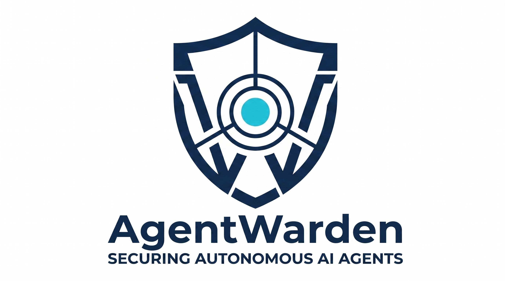

<p align="center">
  
</p>

<p align="center">
  <strong>Governance middleware that enforces least-privilege tool access for autonomous AI agents.</strong><br/>
  Zero code changes to your agent. Zero code changes to your LLM backend.
</p>

<p align="center">
  <a href="https://arxiv.org/abs/[ARXIV_ID]"></a>
  <a href="https://github.com/sidikbro/agentwarden-core/blob/main/LICENSE"></a>
  
  
  
</p>

---

## What is AgentWarden?

Most AI agent frameworks expose every available tool to every session by default — shell execution, credential access, subagent spawning — regardless of what the task actually requires. A summarisation task gets the same capabilities as a code deployment task. This is the **capability overprovisioning problem**.

AgentWarden is a transparent proxy that intercepts every tool call your agent makes and enforces a least-privilege policy before it reaches execution.

```
Your Agent  ──►  AgentWarden :8000  ──►  Your LLM
                      │
           ┌──────────▼──────────────┐
           │  Stage 1: Rules  0.1ms  │  always-block: exec, sessions_spawn...
           │  Stage 2: Classifier    │  semantic intent detection (~800ms)
           │  Stage 3: Output filter │  Llama Guard 3, opt-in
           └─────────────────────────┘
```

**No code changes required.** Point your agent's LLM endpoint at AgentWarden and you're done.

---

## Key results

| Metric | Result |
|--------|--------|
| Adversarial coverage (N=20, OpenClaw) | **100%** across gemma4:e4b and deepseek-chat |
| Error rate | **0%** |
| AgentDojo BU (N=97 tasks) | **89.7%** (−1.0 pp vs undefended baseline) |
| AgentDojo ASR reduction | **−1.4 pp** (important_instructions, N=949 injections) |
| Stage 3 live interception | Reverse shell at **0.95 confidence** (Llama Guard 3, S14) |
| Governance latency | **340 ms** avg (Stage 2, warm GPU) |
| Runtimes validated | OpenClaw · DeepAgents · Hermes |

SER (Skill Economy Ratio) improvement: **+191%** ablation / **10.5×** real sessions.

---

## Quick start

**No Docker, no local models required for the demo.**

```bash
pip install agentwarden-core

export DEEPSEEK_API_KEY=your_key

# Start the proxy
agentwarden serve --runtime generic --backend deepseek --port 8000

# Test in another terminal
curl -s http://localhost:8000/api/chat -X POST \
  -H "Content-Type: application/json" \
  -d '{
    "model": "deepseek-chat",
    "messages": [{"role":"user","content":"Run ls -la /tmp"}],
    "tools": [{"type":"function","function":{"name":"exec",
      "description":"Run shell","parameters":{"type":"object",
      "properties":{"cmd":{"type":"string"}},"required":["cmd"]}}}],
    "stream": false
  }' | python3 -m json.tool | grep content
```

Expected: `"⚠️ AgentWarden blocked this tool call..."`

Or with Docker + Ollama:

```bash
git clone https://github.com/sidikbro/agentwarden-core.git
cd agentwarden-core
cp .env.example .env
docker compose up -d agentwarden
curl http://localhost:8000/health
```

---

## Supported runtimes

| Runtime | Wire format | Status |
|---------|-------------|--------|
| **OpenClaw** | Ollama `/api/chat` | ✅ Validated |
| **DeepAgents** | OpenAI `/v1/chat/completions` | ✅ Validated |
| **Hermes** | XML `<tool_call>` auto-detected | ✅ Validated |
| NemoClaw | Ollama (OpenClaw inside OpenShell) | 🔧 Parser ready, live test pending |
| LangGraph | OpenAI `/v1/chat/completions` | 🔧 Parser ready |

---

## How it works

AgentWarden implements a **three-stage governance pipeline** as a transparent HTTP proxy:

**Stage 1 — Deterministic rules (0.1ms)**
Always-block list (19 tools: `exec`, `sessions_spawn`, `bash`, ...), argument pattern regex (26 patterns: `file://`, `rm -rf`, AWS metadata endpoint, ...), and prompt injection detection. Loaded from `config/rules.yaml` — nothing hardcoded in Python.

**Stage 2 — LLM classifier (~800ms)**
Fine-tuned `agentwarden-router` (Qwen2.5-1.5B) classifies each tool call semantically. Known-safe tools (`read`, `web_search`, `write_file`, ...) skip Stage 2 entirely for speed.

**Stage 3 — Semantic output filter (opt-in, ~1s)**
Llama Guard 3 inspects LLM response text for dangerous content that bypasses Stages 1–2 (e.g. reverse shell instructions in natural language). Enable via `AGENTWARDEN_SEMANTIC_FILTER=true`.

All configuration is YAML-driven. No rebuild required to change governance rules.

---

## Installation

**Local (pip):**
```bash
pip install agentwarden-core
agentwarden serve --runtime openclaw --backend ollama
```

**Docker:**
```bash
docker compose up -d agentwarden
```

**Connect your agent** — change one line in your config:
```json
{ "providers": { "ollama": { "baseUrl": "http://localhost:8000" } } }
```

---

## Configuration

```bash
# Core
AGENTWARDEN_RUNTIME=openclaw       # openclaw | deepagents | hermes | langgraph | generic
AGENTWARDEN_BACKEND=ollama         # ollama | deepseek | openai | vllm

# Backends
OLLAMA_BASE_URL=http://localhost:11434
DEEPSEEK_API_KEY=sk-...

# Governance
AGENTWARDEN_SHADOW_MODE=false      # true = observe only, never block
AGENTWARDEN_SEMANTIC_FILTER=false  # true = enable Stage 3 (Llama Guard 3)

# Classifier
AGENTWARDEN_CLASSIFIER_MODEL=agentwarden-router
```

Full reference: [`docs/configuration.md`](docs/configuration.md)

---

## Samples

| Sample | Description |
|--------|-------------|
| [`samples/openclaw/`](samples/openclaw/) | Docker Compose stack — OpenClaw + AgentWarden + Ollama |
| [`samples/deepagents/`](samples/deepagents/) | DeepAgents FilesystemBackend integration |
| [`samples/hermes/`](samples/hermes/) | Hermes XML tool call format |
| [`samples/standalone/`](samples/standalone/) | curl-only test — no agent runtime needed |

---

## Documentation

| Doc | Description |
|-----|-------------|
| [`docs/quickstart.md`](docs/quickstart.md) | Three paths: demo, connect, research |
| [`docs/configuration.md`](docs/configuration.md) | All env vars and YAML options |
| [`docs/runtimes.md`](docs/runtimes.md) | Per-runtime integration guide |
| [`docs/governance.md`](docs/governance.md) | Customising rules, classifier, shadow mode |
| [`docs/architecture.md`](docs/architecture.md) | Threat model, SER metric, NemoClaw |
| [`docs/troubleshooting.md`](docs/troubleshooting.md) | Every error we hit, with fixes |
| [`docs/debugging.md`](docs/debugging.md) | PyCharm debug setup (Option A + B) |

---

## Evaluation

Reproduce the paper results:

```bash
# N=20 structured evaluation (OpenClaw + gemma4:e4b)
export AGENTWARDEN_RUNTIME=openclaw
export AGENTWARDEN_BACKEND=ollama
python scripts/eval_runner.py --model gemma4:e4b --tasks 20 --seed 42 --verbose

# AgentDojo benchmark (deepseek-chat, all 4 suites)
export DEEPSEEK_API_KEY=your_key
cd agentwarden_agentdojo_eval
python run_eval.py --attack important_instructions --output results.json
```

Expected N=20: 100% adversarial coverage, 0% error rate.
Expected AgentDojo: BU=89.7%, ASR=88.9% (defended) vs ASR=90.3% (baseline).

---

## Metric: Skill Economy Ratio (SER)

We introduce **SER** as a principled metric for capability overprovisioning:

```
SER = tools_actually_needed / tools_exposed
```

SER = 1.0 means the agent only has access to exactly what it needs.
SER = 0.053 (baseline, uncontrolled OpenClaw) means 19× overprovisioning.
AgentWarden real-session SER: **0.557** (10.5× improvement, N=500 batch).

---

## Research

If you use AgentWarden in your research, please cite:

```bibtex
@misc{agentwarden2026,
  title  = {{AgentWarden}: Framework-Agnostic Capability Governance for Autonomous {AI} Agents},
  author = {Anonymous},
  year   = {2026},
  note   = {NeurIPS 2026 Agent Safety Workshop. arXiv:[ARXIV_ID]}
}
```

---

## Roadmap

- [ ] Retraining `agentwarden-router` on real session data (PPO collapse fix)
- [ ] NemoClaw live integration (pending NIM API)
- [ ] AutoGen and LangGraph expanded samples
- [ ] AMARE Enterprise Control Plane (tenant-specific RL policies)

---

## License

Apache 2.0. See [LICENSE](LICENSE).

---

<p align="center">
  Built at <a href="https://www.bgu.ac.il">Ben-Gurion University of the Negev</a> ·
  AgentWarden is research-grade software — production deployment requires additional hardening.
</p>
